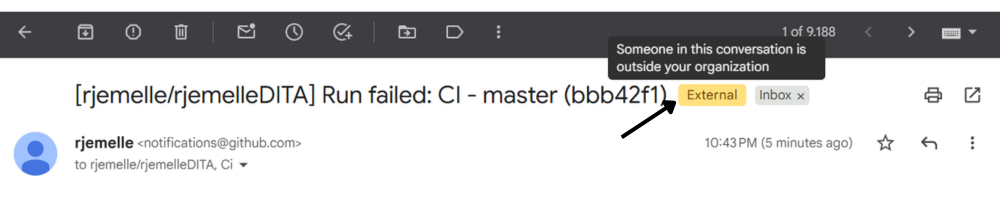
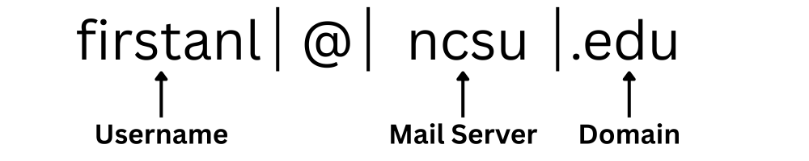

# ***NC State University Phishing Procedure***

## 1.  ***Goals & Prerequisites***
One of the most common scams today is email phishing: tricking people into sharing personal information via email. By replying with personal information or clicking a link, your account can quickly become compromised. 

A study of university students specifically found that almost 70% of university students clicked on phishing emails (Gwenhure, 2025, 4). Phishing emails can lead to identity theft, financial loss, and to further phishing using your account.

This procedure documents how to identify and react to phishing emails. While none of these factors mean an email is absolutely a scam, students should use their best judgment.

## 2. ***Actions***
There are three particularly common locations to find red flags in emails: the email preview, body text, and address.

### 2.1. **Red Flags in the Email Preview**
Before you open an email, you should see several email previews in your inbox. You should be aware of the following signs of a potential scam in an email:

2.1.1. *An Urgent Subject* |
Scammers create a sense of urgency in their emails so you respond without thinking. Emails that use words like “URGENT,” or “RESPONSE NEEDED” are often phishing attempts.

2.1.2. *An incorrect name* |
If you know the sender and their name is spelled incorrectly, it’s likely that the email is a phishing attempt.

.png)

### 2.2 **Red Flags in the E-mail itself**
If you click on the email, you may see the following red flags in the text. All of these should be treated as signs of a phishing attempt.

2.2.1. *Poor grammar* |
While poor grammar is not always a sign of phishing, it is a very common phishing tell — especially if it differs from other emails you’ve received from this source.

2.2.2. *Personal information requests* |
NC State and its employees will never ask for your personal information over email. Any email requesting usernames, passwords, or financial information is a likely phishing attempt.

2.2.3. *Generic greetings* |
NC State professors and administration, along with websites you sign up for, should have your name already. Greetings that don’t state the student’s name, such as “Dear Student” or “Hello,” may indicate the sender doesn't know your actual name and should be treated with suspicion. 

2.2.4. *Google external account warning* |
You see the warning symbol below when you receive emails from non-NC State accounts. If a member of the NC State community sends you an email from an external account, it may be a phishing attempt.

### 2.3. **Red Flags in the E-mail address**
Even if the email seems legitimate, you should always review the email sender’s address. There are three parts to an email address: the email domain, mail server, and username.

Check all three sections to ensure the following red flags aren’t there

2.3.1 *Odd username* |
Sometimes the username has nothing to do with the user’s name—or is an incorrectly spelled version of the user’s name. If the username seems completely unfitting, it’s likely  phishing

2.3.2 *Unrelated or incorrect mail server* |
The mail server usually states the sender’s organization’s name (or its abbreviated name). Incorrectly spelled or unrelated servers are likely phishing attempts.

2.3.3 *Incorrect domain* |
Emails from organizations will come from a specific type of domain. Depending on the company, the domain may be a .org, .edu, or .com. Make sure the email’s domain matches what you’d usually receive from that address. All emails from NC State accounts should come from a .edu domain.

### 2.4. **Verifying and Reporting**
If you believe an email is a phishing attempt, do not respond. If you need to verify the email is a phishing attempt, contact the real sender via a verified alternative platform, like your phone or another email. If you do not know the sender, and you are not sure they are a legitimate source, do not respond.

If you confirm it is a phishing attempt or can tell it is a phishing attempt, then report it to NC State immediately. To learn how to report phishing emails to NC State, visit this link.

## ***3.  Stopping a Phishing Attack*** |
If you do accidentally click a phishing link, don’t panic — you still have time to minimize damage. Do the following:

3.1. *Change phishing-affected passwords* |
If you clicked on a link or sent a password, change the potentially compromised account’s password immediately. For example, if you clicked on an email, change your email password.

3.2. *Alert NC State IT immediately* |
You will not be penalized for clicking on a phishing link — NC State IT needs to know solely to protect you and the university. Email help@ncsu.edu or call 919-515-HELP(4357) immediately (McCollum, 2026). 
***
**References**

Gwenhure, A. K. (2025, November 4). University students' security behavior against email phishing attacks: insights from the health belief model. Journal of Cybersecurity, 11(1), 1-19. https://academic.oup.com/cybersecurity/article/11/1/tyaf034/8313771

McCollum, S. (2026, July 7). Think Before You Click: Beware of Phishing Emails. NC State Extension. https://eit.ces.ncsu.edu/news/think-before-you-click-beware-of-phishing-emails/
***
# Reflection
## Video
Physical: I used Canva to design different slides and transitions to improve the visuals. I used fonts readable on a computer or phone screen, kept text on screen long enough for the reader to see and/or hear me discuss it. I paced it so points aren’t overlapping. The video is in 1080p (that’s the highest Canva allowed me to render for free. I synced audio 

Cognitive: In terms of accuracy, all of the information is supported by NC State IT, the Journal of Cybersecurity, or general cybersecurity advice. I used introductory and conclusion slides. I organized it in the same structural style as the reading so . So, I started from the greeting, then moved into textual issues. The external marker was the sole exception, but that was because it technically wasn’t a part of the email body text. However, I still considered it an important part of the UI, so I kept it. 

Affective: For confidence, I used sources, direct language, and references to other NC State materials with trusted authority. That direct language supported user self-efficacy—along with the fact that I avoided referencing overly technical details — hence why I didn’t explain the email address sections.

Optional: I decided to play a bit with effects, especially since I was using Canva. So, I added transitions between “slides,” which allowed me to emphasize certain parts of the email. Besides that, they also provided a visual break from staring at a screen recording. This also allowed me to use “zoom shots” (transitions between close-up shots of the paper) to draw attention to important details. This also allowed me to use an asset I cut from the paper procedure because they were too long. Thus, I was able to use examples to further improve reader understanding.

## Procedure
I tried to pace all sentences with the minimal but existent context (ex. “Scammers create a sense of urgency in their emails so you respond without thinking. Emails that use words like “URGENT,” or “RESPONSE NEEDED” are often phishing attempts.”). Read to Learn to Do audiences do want to understand what they’re doing, but aren’t here to solely learn (and overexplaining will cause problems, so I ensured that the “learning” portion is as condensed as possible. I don’t overexplain context — including how to open Gmail or how to navigate the inbox. 

The procedure is split into several tasks, though I will admit that I defined “task” the same for each action item — that being to look at certain features in an email to determine if they contain red flags. It’s split into the traditional “goals, prerequisites (though it’s folded into goals due to antincipated user prior knowledge), actions, and unwanted states. I clearly define the goal within the first three paragraphs. Before listing each action, I state what the reader should do for each one. Unwanted states is a brief section (because NC State’s own source is brief), but I think it’s for the best, as it gives readers confidence that they can handle the state.

I used images for two purposes: clarification and examples. I used the picture of the email to quickly diagram the different parts of the email so I could explain the different ways scammers attempt to trick students. It allowed me to avoid explaining the location of the text within the email address, which would have been clunky and overly-wordy. Otherwise, I used it to provide examples of possible errors (see the first email preview picture), or to show where certain indicators are located (the external symbol). I also used them to break up the rhythm of text, but that was more of a plus rather than the main goal.
